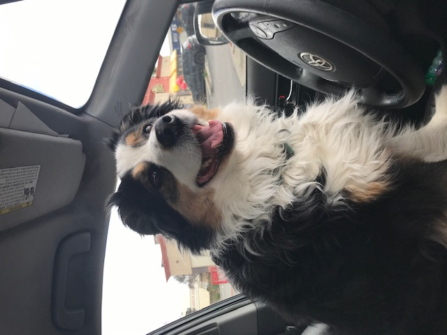

## Welcome to Tiffany's user page!

[Lab 1 checklist](https://github.com/tofjinew/tofjinew.github.io#checklist-for-cse-110-lab-1)

I am a second year undergraduate student at UC San Diego studying computer science.

- I can write complicated programs like this one:

```python
print('Hello, world!')
```

### Hot Wheels :car:

> Wisdom is a circle. What you receive, you must give back.

\- Dr. Tesla, _Hot Wheels: World Race_ (2003)

My favorite movie series is the Hot Wheels Acceleracers animated series released by Mattel in 2005. It features the events surrounding a band of street racers recruited by a rogue scientist to race against evil drones in another dimension containing unique race tracks created by aliens, perhaps to save humanity. There are four movies in total (with several short mini episodes in between), though there was a planned fifth one, unfortunately cancelled because "the \[marketing team\] felt \[the series\] had become more popular than the Hot Wheels brand itself". Despite that opinion, I have never met another person who has heard of this series, and so I am very dedicated to sharing it with as many people as I can (hence this section).

[Here](https://www.youtube.com/watch?v=g5u7y1rBJGY) is a music video containing clips from the third movie.



my dog wishes he could drive like they do in the movies

### Checklist for CSE 110 Lab 1:

- [x] Pictures
- [x] Headings
- [x] Styling text
- [x] Quoting text
- [x] Quoting code
- [x] Links
- [x] Section links
- [x] Relative links
- [x] Lists
- [x] Task lists


